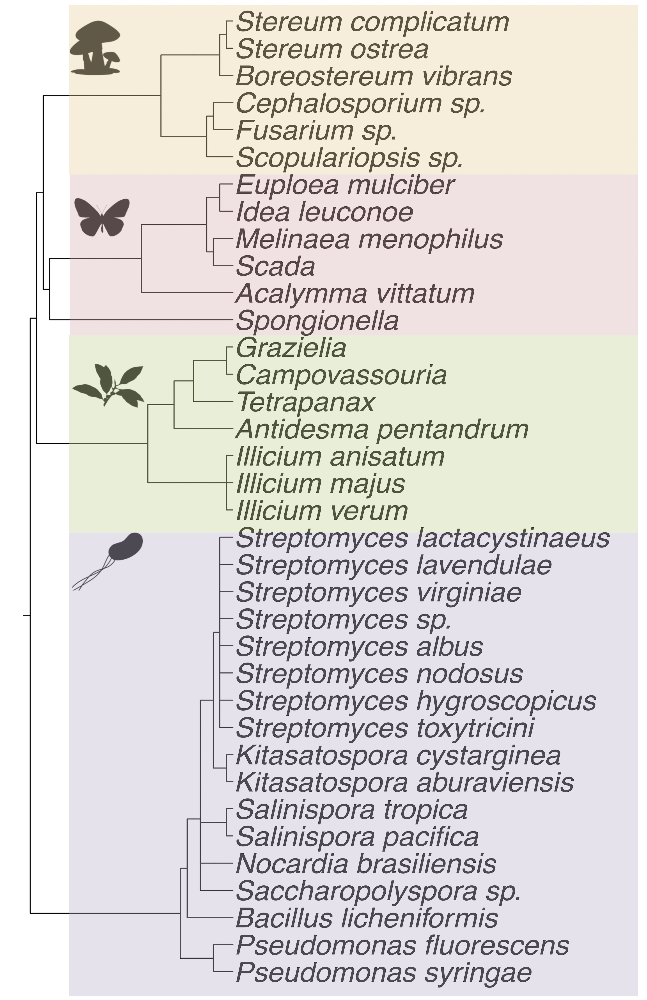

---
title: "β-Lactone Tool (βLT)"
output:
  flexdashboard::flex_dashboard:
    theme: bootstrap
    vertical_layout: fill
    logo: www/BLT_logo.jpg
    favicon: www/BLT_logo.jpg
    social: menu
    css: styles.css
runtime: shiny
---

```{r setup, include=FALSE}
# install.packages("genoPlotR")
# install.packages("xTable)
# install.packages("data.table")
# install.package("RColorBrewer")
library("flexdashboard")
library("tidyr")
library("data.table")
library("genoPlotR")
library("shiny")
library("xtable")
library("RColorBrewer")
```


```{r global}
## Read in the datasets
## This is the chemical compound dataset
tab<-fread("data/beta_lactone_table.csv",header=T,data.table=F)
```

Home
=====================================


Column {.sidebar}
-----------------------------------------------------------------------

***
***
**Welcome to the β-Lactone tool**
<br>
β-Lactones are four-membered ring structures found in many chemical compounds produced in nature. β-Lactones often have anticancer and/or antibiotic properties. They are a rich source for novel drug-like molecules.
<br>
<br>
The βLT is a consolidated web app to explore β-lactone natural products and their biosynthetic gene clusters.  Ultimately we hope it will advance the discovery of new β-lactone drugs.
<br>
<br>
This site is maintained by [Dr. Larry Wackett's lab](https://cbs.umn.edu/wackett-lab/home) at the University of Minnesota.  
<br>
<br>
The [Wackett](https://cbs.umn.edu/wackett-lab/home) and [Wilmot](https://cbs.umn.edu/contacts/carrie-m-wilmot) labs discovered and characterized the first β-lactone synthetase enzyme ([Christenson *et al.* 2017](http://pubs.acs.org/doi/abs/10.1021/acs.biochem.6b01199)). A major focus in the lab is β-lactone natural product discovery and sharing these findings with the scientific community via the βLT. For more information, see our publications:    
<br>
<br>
1. Christenson JK, Richman JE, Jensen MR, Neufeld JY, Wilmot CM, Wackett LP. [**β-Lactone Synthetase Found in the Olefin Biosynthesis Pathway.**](http://pubs.acs.org/doi/abs/10.1021/acs.biochem.6b01199) *Biochemistry.* 2017;56(2):348-51.  [doi:10.1021/acs.biochem.6b01199.](http://pubs.acs.org/doi/abs/10.1021/acs.biochem.6b01199)   
<br>
<br>
2. Christenson, JK, Robinson, SL, Engel, TA, Richman, JE, Kim, AN, Wackett, LP. [**β-Lactone decarboxylase: Function, mechanism, and linkage to class III haloalkane dehalogenases.**](http://pubs.acs.org/doi/abs/10.1021/acs.biochem.7b00667?src=recsys)  *Biochemistry.* 2017; Epub ahead of print. [doi: 10.1021/acs.biochem.7b00667.](http://pubs.acs.org/doi/abs/10.1021/acs.biochem.7b00667?src=recsys)    

Column
-----------------------------------------------------------------------
```{r, out.width = "100%"}
knitr::include_graphics("www/Lactone_Structures3.jpg")
```

Browse
===================================== 

Column {.sidebar data-width=600}
-----------------------------------------------------------------------
<br>
<br>
Natural products are produced by special proteins called **enzymes** that speed up chemical reactions. These proteins are encoded in the DNA of organisms, and we can use computational tools to identfiy these genes and predict which natural product is being formed. 
<br>
<br>
On this page you can click on a β-lactone natural product below to observe and interact with the the gene cluster that encodes it.
<br> 
<br>
We only known the gene clusters for 7 β-lactone compounds. This means we still don't know the biosynthetic origin for >75%  of all known β-lactone natural products! There is a whole universe of gene clusters waiting to be discovered.
<br>
<br>
**Click a compound below to view its gene cluster:**
<br>
<br>
```{r}
tags$button(
        id = "belactosin",
        class = "btn action-button",
        tags$img(src = "www/belactosin.png",
                 height = "100px")
      )
      
      tags$button(
        id = "lipstatin",
        class = "btn action-button",
        tags$img(src = "www/lipstatin.png",
                 height = "100px")
      )

      tags$button(
        id = "obafluorin",
        class = "btn action-button",
        tags$img(src = "www/obafluorin.png",
                 height = "100px")
      )   

      tags$button(
        id = "oxazolomycin",
        class = "btn action-button",
        tags$img(src = "www/oxazolomycin.png",
                 height = "100px")
      )
      
      tags$button(
        id = "salinosporamide",
        class = "btn action-button",
        tags$img(src = "www/salinosporamide.png",
                 height = "100px")
      )
      
      
      tags$button(
        id = "cystargolide",
        class = "btn action-button",
        tags$img(src = "www/cystargolide.png",
                 height = "100px")
      )
      
      tags$button(
        id = "ebelactone",
        class = "btn action-button",
        tags$img(src = "www/ebelactone.png",
                 height = "100px")
      )

```

Column {.bgwhite}
-----------------------------------------------------------------------
```{r}   
  source("src/gene_plot.r") #function that plots gene clusters
  rv <- reactiveValues(table = NULL, gen = NULL, nam = NULL)
  
  filpath <- "data/fasta_prot_bgcs/"
  fils <- list.files(filpath)
  #========#
  
  observeEvent(input$cystargolide, {
    # Table
    rv$nam <- "Cystargolide"
    ab <- tab[grep(rv$nam, tab$Natural_product),]
    abt <- data.frame(t(ab))
    abt[,2] <- abt[,1]
    abt[,1] <- paste0(rownames(abt),":")
    colnames(abt) <- NULL
    rv$table <- xtable(abt)
    
    # Gene plot
    faa <- fils[grep(rv$nam, fils)]
    seqs <- read.csv(paste0("data/gene_clusters/", rv$nam, ".csv"),check.names = T)
    rv$gen <- seqs
  })
  
  
  observeEvent(input$salinosporamide, {
    # Table
    rv$nam <- "Salinosporamide"
    ab <- tab[grep(rv$nam, tab$Natural_product),]
    abt <- data.frame(t(ab))
    abt[,2] <- abt[,1]
    abt[,1] <- paste0(rownames(abt),":")
    colnames(abt) <- NULL
    rv$table <- xtable(abt)
    
    # Gene plot
    faa <- fils[grep(rv$nam, fils)]
    seqs <- read.csv(paste0("data/gene_clusters/", rv$nam, ".csv"),check.names = T)
    rv$gen <- seqs
  })
  
  
  observeEvent(input$ebelactone, {
    # Table
    rv$nam <- "Ebelactone"
    ab <- tab[grep(rv$nam, tab$Natural_product),]
    abt <- data.frame(t(ab))
    abt[,2] <- abt[,1]
    abt[,1] <- paste0(rownames(abt),":")
    colnames(abt) <- NULL
    rv$table <- xtable(abt)
    
    # Gene plot
    faa <- fils[grep(rv$nam, fils)]
    seqs <- read.csv(paste0("data/gene_clusters/", rv$nam, ".csv"),check.names = T)
    rv$gen <- seqs
  })  
  
  observeEvent(input$obafluorin, {
    # Table
    rv$nam <- "Obafluorin"
    ab <- tab[grep(rv$nam, tab$Natural_product),]
    abt <- data.frame(t(ab))
    abt[,2] <- abt[,1]
    abt[,1] <- paste0(rownames(abt),":")
    colnames(abt) <- NULL
    rv$table <- xtable(abt)
    
    # Gene plot
    faa <- fils[grep(rv$nam, fils)]
    seqs <- read.csv(paste0("data/gene_clusters/", rv$nam, ".csv"),check.names = T)
    rv$gen <- seqs
  })  
  
  observeEvent(input$lipstatin, {
    # Table
    rv$nam <- "Lipstatin"
    ab <- tab[grep(rv$nam, tab$Natural_product),]
    abt <- data.frame(t(ab))
    abt[,2] <- abt[,1]
    abt[,1] <- paste0(rownames(abt),":")
    colnames(abt) <- NULL
    rv$table <- xtable(abt)
    
    # Gene plot
    faa <- fils[grep(rv$nam, fils)]
    seqs <- read.csv(paste0("data/gene_clusters/", rv$nam, ".csv"),check.names = T)
    rv$gen <- seqs
  })  

  observeEvent(input$belactosin, {
    # Table
    rv$nam <- "Belactosin"
    ab <- tab[grep(rv$nam, tab$Natural_product),]
    abt <- data.frame(t(ab))
    abt[,2] <- abt[,1]
    abt[,1] <- paste0(rownames(abt),":")
    colnames(abt) <- NULL
    rv$table <- xtable(abt)
    
    # Gene plot
    faa <- fils[grep(rv$nam, fils)]
    seqs <- read.csv(paste0("data/gene_clusters/", rv$nam, ".csv"),check.names = T)
    rv$gen <- seqs
  }) 
  
  observeEvent(input$oxazolomycin, {
    # Table
    rv$nam <- "Oxazolomycin"
    ab <- tab[grep(rv$nam, tab$Natural_product),]
    abt <- data.frame(t(ab))
    abt[,2] <- abt[,1]
    abt[,1] <- paste0(rownames(abt),":")
    colnames(abt) <- NULL
    rv$table <- xtable(abt)
    
    # Gene plot
    faa <- fils[grep(rv$nam, fils)]
    seqs <- read.csv(paste0("data/gene_clusters/", rv$nam, ".csv"),check.names = T)
    rv$gen <- seqs
  })
  
  plotOutput("genplot", height = 100, width = 700,
                 click = "plot_click")
  
  output$genplot <- renderPlot({
    if(!is.null(rv$gen)){
      seg <- list(dna_seg(rv$gen))
      plot_gene_map(seg, gene_type = "arrows", main = paste0(rv$nam, " Gene Cluster"))
    }
  })
  
  verbatimTextOutput("gene_names")
  
  output$gene_names <- renderPrint({
    dtf <- data.frame(rv$gen)
    tmp <- nearPoints(dtf, input$plot_click, xvar = "x", yvar = "y", threshold = 200, maxpoints = 1)
    cat(paste0("click on gene for \ngene name: ",gsub("_", " ", tmp$name)))
  })
  
 renderTable({
    rv$table
  })

```  

Database
===================================== 
***
***

Inputs {.sidebar}
-----------------------------------------------------------------------
<br>
<br>
This is a comprehensive database of all β-lactone natural products known to date. Search below by compound, name, taxonomy, or keyword.
```{r}

      selectizeInput("drug", "Search by compound name:",
                    choices = c(sort(tab$Natural_product)),
                     selected = NULL, multiple = TRUE
      )

      selectizeInput("taxa", "Search by taxonomy:",
                   choices = c(sort(tab$Organism)),
                   selected = NULL, multiple = TRUE
      )
      
      textInput("search", label = "Search by keyword:",
                value = 'e.g. Lipstatin'
      )
 
```

Outputs
-----------------------------------------------------------------------
```{r}   
 renderTable({
      srch <- tab[grep(input$search, tab$Natural_product),]
      cmpd <- tab[tab$Natural_product %in% input$drug,]
      tax <- tab[tab$Organism %in% input$taxa,]
      out <- data.frame(rbind(cmpd, tax, srch))
      dedup <- out[!duplicated(out),]
      return(xtable(dedup))
    })
```   

Phylogeny
=====================================

Column {.sidebar}
-----------------------------------------------------------------------
<br>
<br>
β-lactone natural products are produced by diverse organisms spread all across the tree of life.
<br>
<br>
This is the phylogenetic tree of source organisms for all β-lactone natural products isolated to date. 
<br>
<br>
**Click the buttons below to view the compounds they form:**
<br>
```{r}

      tags$button(
        id = "fungi",
        class = "btn action-button",
        tags$img(src = "www/fungi_jpeg.jpg",
                 height = "100px")
      )

       tags$button(
        id = "animals",
        class = "btn action-button",
        tags$img(src = "www/animals_jpeg.jpg",
                 height = "100px")
      )
       tags$button(
        id = "plants",
        class = "btn action-button",
        tags$img(src = "www/plants_jpeg.jpg",
                 height = "100px")
      )

      tags$button(
        id = "bacteria",
        class = "btn action-button",
        tags$img(src = "www/bacteria_jpeg.jpg",
                 height = "100px")
      )
      
```

Column {.bgwhite}
-----------------------------------------------------------------------
<br>
<br>
```{r, out.width = "400px"} 

```  

Column {.bgwhite}
-----------------------------------------------------------------------
<br>
<br>
<br>
```{r, out.width = "400px"} 

rv <- reactiveValues(img = 'www/np_dwnloads/white.png') # If nothing is activated, then just a white box

observeEvent(input$fungi, {
     rv$img <- "www/fungi_structs.jpg"
   })

observeEvent(input$animals, {
     rv$img <- "www/animal_structs.jpg"
   })

observeEvent(input$plants, {
     rv$img <- "www/plant_structs.jpg"
   })

observeEvent(input$bacteria, {
     rv$img <- "www/bacteria_structs.jpg"
   })

output$img <- renderImage({
   list(src = rv$img)
}, deleteFile = FALSE)

imageOutput("img")
```


